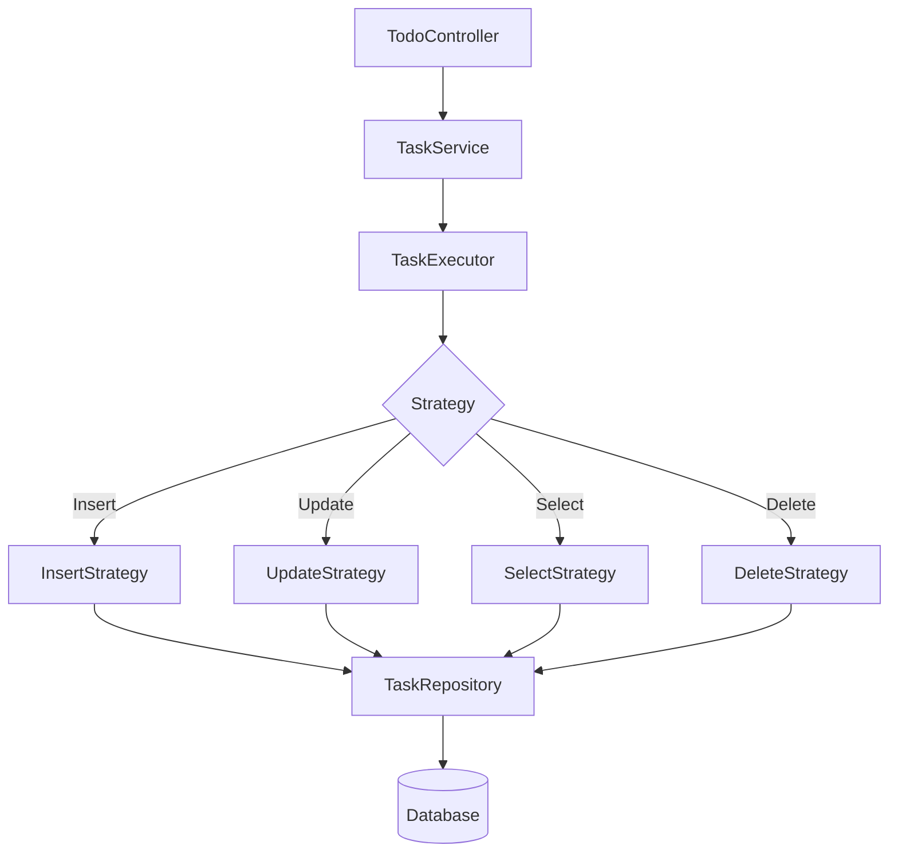

# OV-TODO Application

## Documentation / Documentação

### English
**ov-todo** is a Task Management System (ToDo List) built with Java and Spring Boot. It allows users to create, read, update, and delete tasks, organizing them into categories.

#### Features
*   Task CRUD (Create, Read, Update, Delete).
*   Task categorization.
*   Status management (PENDING, DONE).
*   Web Interface using Thymeleaf.
*   H2 Database for development/testing.

#### Architecture
The project follows a layered architecture:
1.  **Controller:** Handles HTTP requests (`TodoController`).
2.  **Service:** Business logic, implementing the Strategy pattern for operations (`TaskService`, `TaskExecutor`).
3.  **Repository:** Data access abstraction (`TaskRepository`).
4.  **Domain:** Entities and DTOs.

#### How to Run
1.  Ensure Java 21 is installed.
2.  Run `mvn spring-boot:run`.
3.  Access `http://localhost:8080/tasks`.

---

### Português
**ov-todo** é um Sistema de Gerenciamento de Tarefas (Lista de Tarefas) construído com Java e Spring Boot. Permite aos usuários criar, ler, atualizar e excluir tarefas, organizando-as em categorias.

#### Funcionalidades
*   CRUD de Tarefas (Criar, Ler, Atualizar, Excluir).
*   Categorização de tarefas.
*   Gerenciamento de status (PENDENTE, CONCLUÍDO).
*   Interface Web usando Thymeleaf.
*   Banco de dados H2 para desenvolvimento/testes.

#### Arquitetura
O projeto segue uma arquitetura em camadas:
1.  **Controller:** Lida com requisições HTTP (`TodoController`).
2.  **Service:** Lógica de negócios, implementando o padrão Strategy para operações (`TaskService`, `TaskExecutor`).
3.  **Repository:** Abstração de acesso a dados (`TaskRepository`).
4.  **Domain:** Entidades e DTOs.

#### Como Executar
1.  Certifique-se de que o Java 21 está instalado.
2.  Execute `mvn spring-boot:run`.
3.  Acesse `http://localhost:8080/tasks`.

## Project Structure / Estrutura do Projeto

